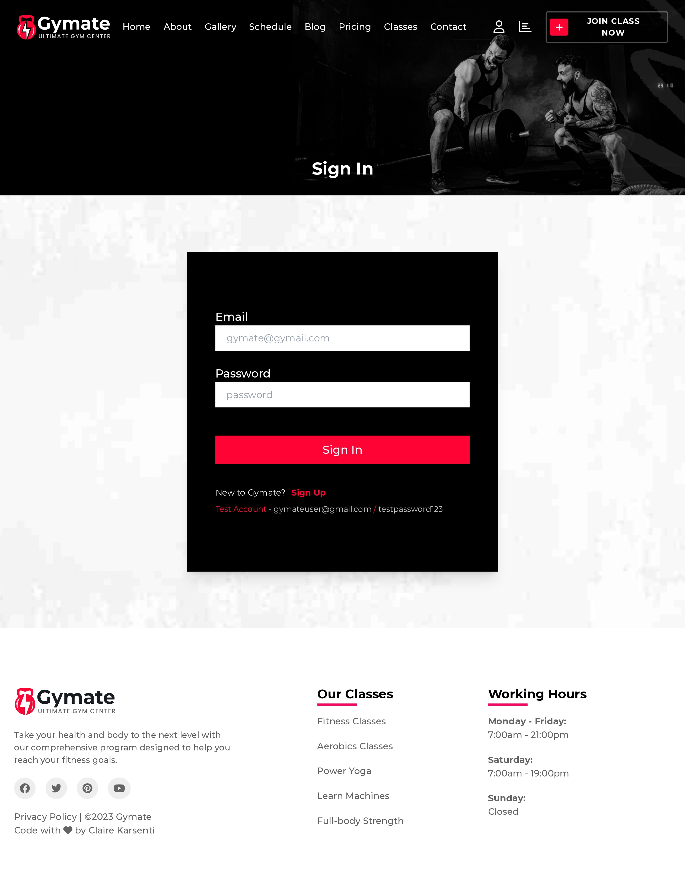
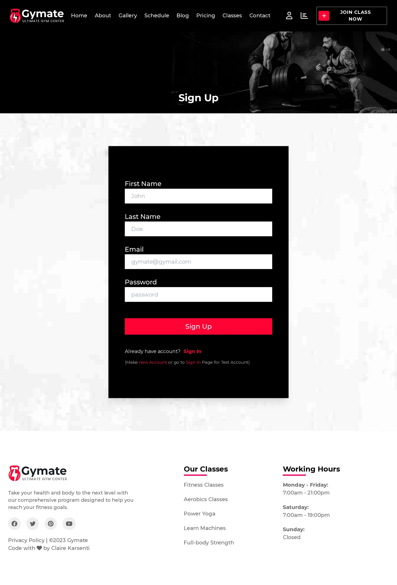
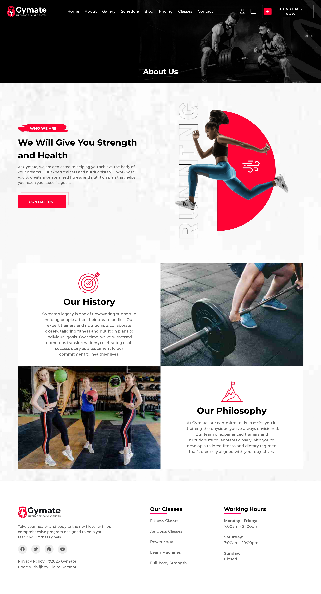
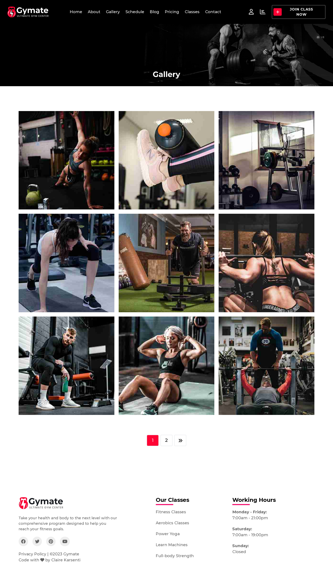
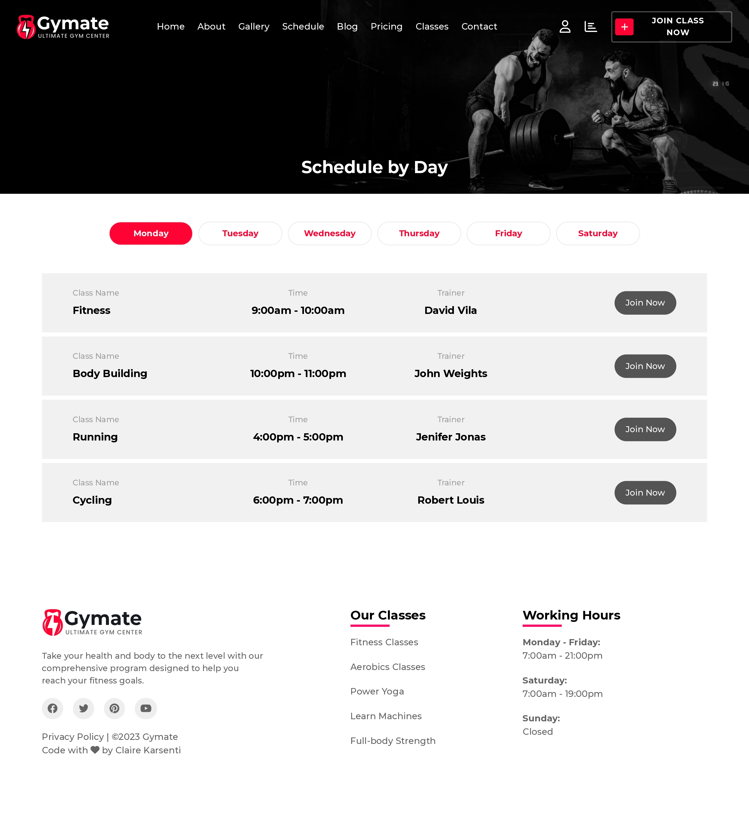
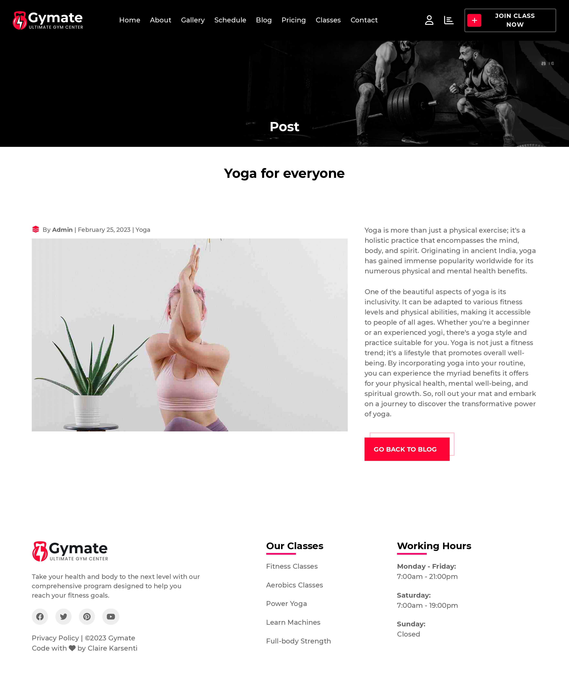
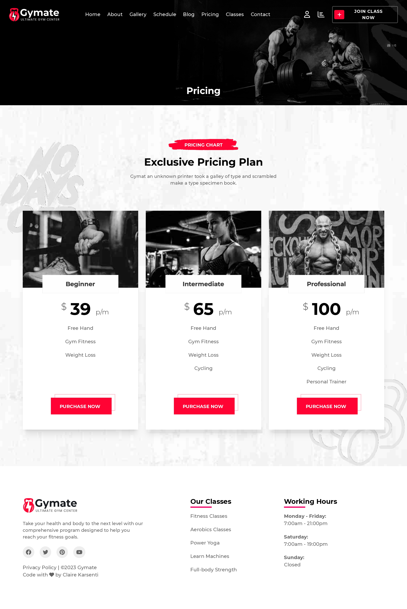
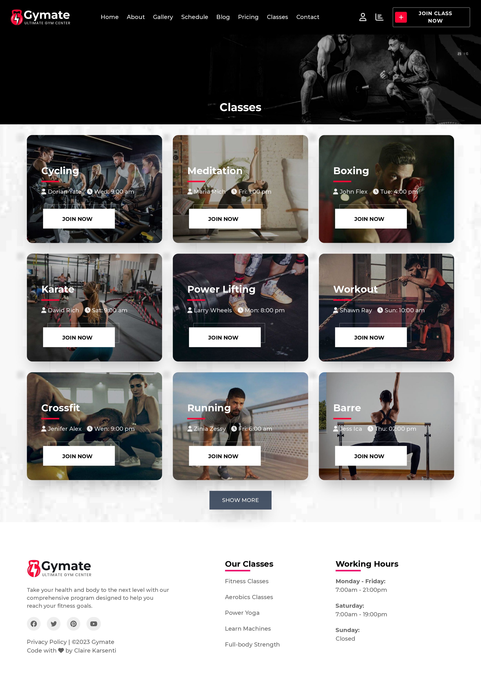
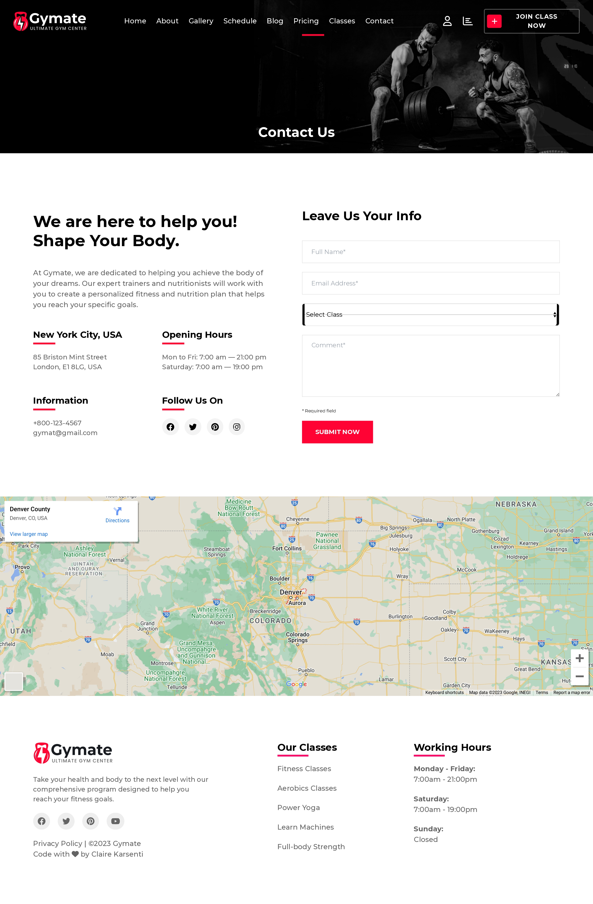

# Gymate - Gym center website

- [Gymate - Gym center website](#gymate---gym-center-website)
  - [About the project](#about-the-project)
    - [Stack](#stack)
    - [Features](#features)
    - [Link](#link)
  - [Screenshots of the Project](#screenshots-of-the-project)
    - [Home Page](#home-page)
    - [Login Page](#login-page)
    - [SignUp Page](#signup-page)
    - [About Page](#about-page)
    - [Gallery Page](#gallery-page)
    - [Schedule Page](#schedule-page)
    - [Blog Page](#blog-page)
    - [Post Page](#post-page)
    - [Pricing Page](#pricing-page)
    - [Classes Page](#classes-page)
      - [Reduce Page](#reduce-page)
      - [Extend Page](#extend-page)
    - [Contact Page](#contact-page)

## About the project

This immersive social platform, built with React and Material UI, empowers users to connect with friends, share special moments, and explore a world of interactive content. With a contemporary and user-friendly layout, it also offers a dark mode for the optimal user experience.

### Stack

- React
- Redux
- Tailwind
- Node.js
- MongoDB
- TypeScript

### Features

- Auth

### Link

[Gymate website demo](https://gymate-clairekarsenti.netlify.app/)

## Screenshots of the Project

### Home Page

### Login Page

### SignUp Page

### About Page

### Gallery Page

### Schedule Page

### Blog Page

### Post Page

### Pricing Page

### Classes Page

#### Reduce Page

#### Extend Page

### Contact Page

